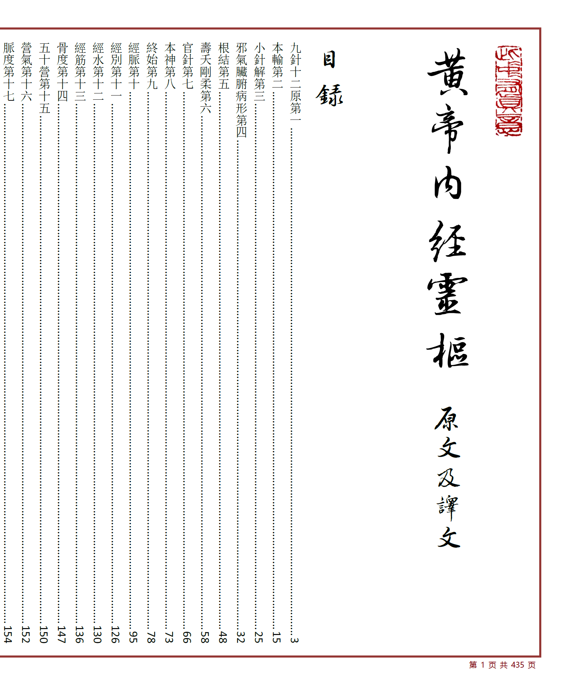
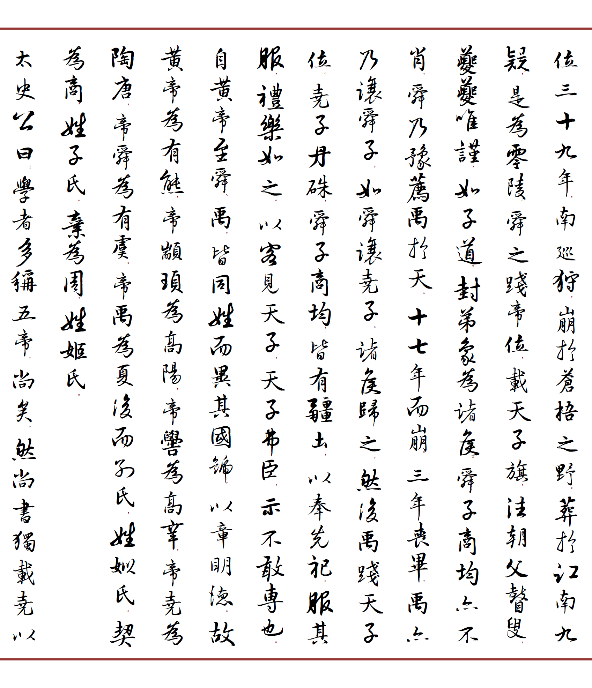
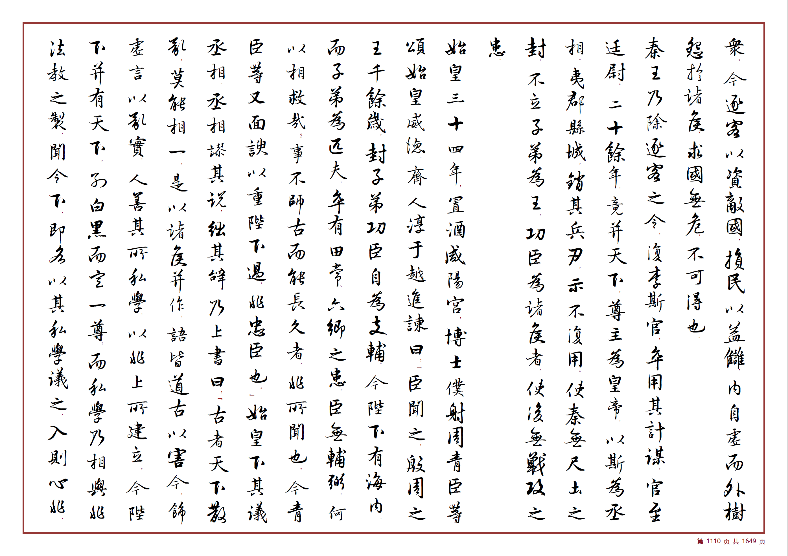
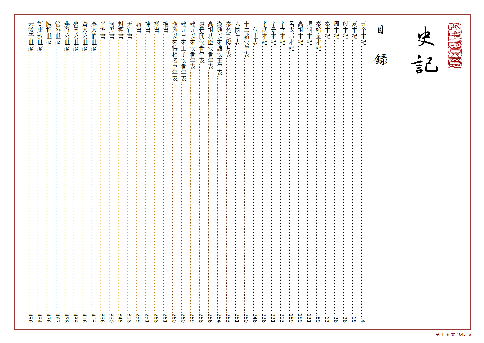
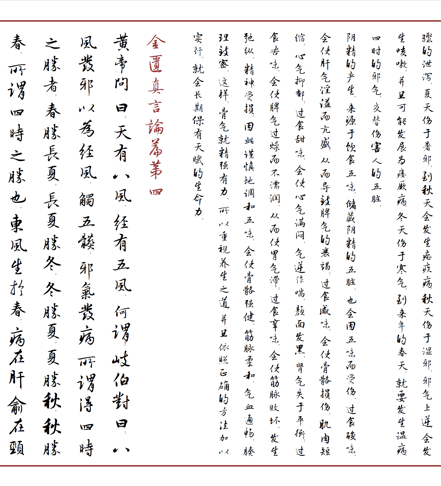
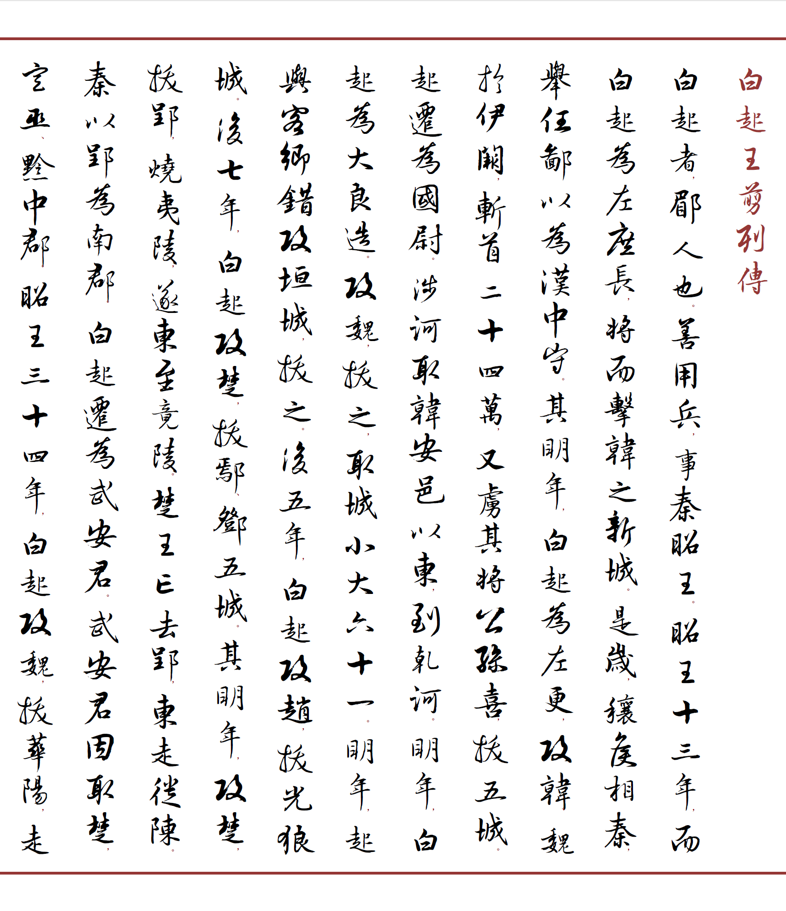
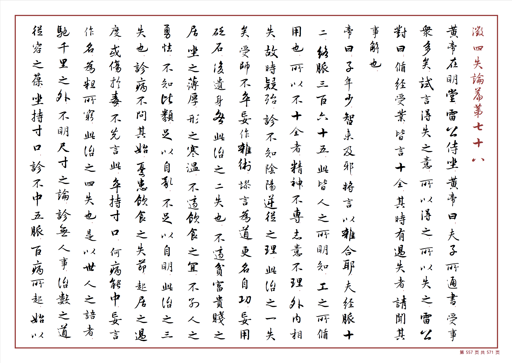

# 高迪行书竖排 Skill

> 将书法之美、文化之远融入数字时代。

古典文本来源驳杂。即使是 PDF、EPUB、MOBI 等格式，也会因为年代久远，存在大量生僻字必须用图片或分裂偏旁部首的方式表达，有时甚至直接用黑框或问号代替。TXT 文档往往来源于 OCR，更是错误百出。繁简转换也经常因为简字一对多繁字而发生语义错误。因此，古典文本排版首先需要一个干净完整、经历多文本来源校验的**文本清洗**过程。

古典文本排版工作量浩繁。本项目总结排版技巧，在 AI 时代写成 Skill，逐步累积排版经验，让很多以前难以完成的工作变得可以高效实现。

高迪书法字库系列程序采用开源方式发布，欢迎共同改进。

<table align="center"><tr>
  <td></td>
  <td></td>
</tr></table>

<p align="center"><em>左：文心雕龙 &nbsp;&nbsp; 右：黄帝内经 · 灵枢</em></p>

---

## 功能概览

### 1. 文本提取与清洗

从 EPUB、PDF、MOBI 等来源提取需要的文本。OCR 文本常见错误（形近字、标点丢失、繁简混杂、生僻字拆分偏旁部首）均有经验集和自动修正方案。支持多文本来源交叉校验。

**工作流：**
```
EPUB → 解压 HTML → BeautifulSoup 清理 → 结构化文本
PDF  → OCR → 状态机提取 → 偏旁合并 → 校对
TXT  → 人工校对 → 清洗
```

### 2. 排版格式

| 元素 | 字体 | 字号 | 行距 | 说明 |
|------|------|------|------|------|
| 正文 | 高迪书法AI_行书V1 | 一号（26pt） | 42.6pt 固定 | 繁体，两端对齐 |
| 章节标题 | 高迪书法AI_行书V1 | 一号（26pt） | 42.6pt 固定 | 深红色，防孤行 |
| 译文 | 高迪书法AI_行书V1 | 三号（16pt） | 单倍 | 前后空行 |
| 竖排标点 | 楷体 | 小四（12pt） | — | 深红色，上标定位 |

### 3. 高迪竖排标点

现代标点符号适合阅读，但会极大影响书法作品的连贯性，对竖排书籍影响尤其明显。

本 Skill 对不同标点做不同处理：采用改变色彩（深红）、缩小字体（小四 12pt）并设为上/下标的方式，减少标点对书法的影响。

| 原字符 | 替换为 | 处理方式 | 效果 |
|--------|--------|----------|------|
| " " (双引号) | 『 』 | 上标/下标 | 竖排角括号 |
| ' ' (单引号) | 「 」 | 上标/下标 | 竖排角括号 |
| 《》 (书名号) | ﹏ | 不变 | 竖排浪线 |
| （）(括号) | ︵ ︶ | 不变 | 直式括号 |
| ，。！？；：、…·～ | 不变 | 上标 | 缩小淡化 |

<p align="center">
  
</p>
<p align="center">
  
</p>

<p align="center"><em>标点缩小淡化，保持书法文字的连续感</em></p>

### 4. 高迪智能目录

目录对应章节，目录页码可通过右键「更新域」（Ctrl+A → F9）的方式更新对应章节。基于 Word TC + TOC 域机制，兼容 WPS 和 Microsoft Word。

<p align="center">
  
</p>

<p align="center"><em>智能目录 — 点击条目直达指定章节，排版调整后 F9 一键更新页码</em></p>

**生成智能目录需要的条件：**
- 正文标题必须是独立段落
- 标题需含可识别的章节模式（如"篇"+"第"、体裁名等）
- 每个章节标题唯一不重复

### 5. 高迪繁简转换

繁简转换存在一些特殊的规则。例如「里程」的"里"和「里外」的"里"（繁体为"裏"）在繁体中是两个字。必须根据语义转换，而不能直接一一对应。

- 原文为简体时：全文转繁体，使用 opencc s2t 模式（含词组级别语义判断）
- 原文为繁体时：只改一对多部分，智能判断语义

常见一对多字符：里→里/裏、发→發/髮、干→幹/乾/干、面→面/麵、历→歷/曆、钟→鐘/鍾……

<table align="center"><tr>
  <td></td>
  <td></td>
</tr></table>

<p align="center"><em>繁简混排处理、标题段首控制</em></p>

---

## 完整工作流

```
文本提取 → 清洗切分 → 模板排版 → 段落优化 → 字库检查 → 繁简转换 → 竖排标点 → 智能目录
```

1. **文本提取** — 从 EPUB/PDF/TXT 获取原始文本，OCR 常见错误自动修正
2. **清洗切分** — 去除多余空白、统一标点、按篇章切分、区分正文与译文
3. **模板排版** — 复制已有成品 docx 作为模板，替换正文内容（保留页面边框、印章、页码等）
4. **段落优化** — 合并碎片段落（对话标记分段、问答对合并）
5. **字库检查** — 比较文档用字与字库覆盖范围，列出缺失字符
6. **繁简转换** — 语义感知的简繁转换，正确处理一对多映射
7. **竖排标点** — 标点缩小淡化、字形替换（引号→角括号、书名号→浪线、括号→直式）
8. **智能目录** — 生成可更新的 TC + TOC 域目录

<p align="center">
  
</p>

---

## 项目结构

```
高迪行书竖排skill/
├── README.md                         # 本文件
├── images/                           # 效果展示图片
├── 高迪行书竖排/                      # 主 Skill（完整工作流）
│   ├── SKILL.md                      # 工作流文档
│   └── scripts/
│       ├── extract_pdf.py            # PDF 提取（章节、原文、译文）
│       ├── pdf_proofread.py          # PDF vs DOCX 逐章校对
│       └── check_missing_chars.py    # 字库缺失字符检测
├── 高迪书法竖排标点/                   # 子 Skill（竖排标点）
│   ├── SKILL.md
│   └── scripts/
│       └── fix_punctuation.py        # 竖排标点替换
├── 高迪智能目录/                       # 子 Skill（智能目录）
│   ├── SKILL.md
│   └── scripts/
│       └── smart_toc.py              # TC + TOC 域生成
└── 高迪繁简转换/                       # 子 Skill（繁简转换）
    ├── SKILL.md
    └── scripts/
        └── s2twp.py                  # 语义感知简繁转换
```

## 依赖

- Python 3 + python-docx + lxml + opencc + fontTools
- WPS Office 或 Microsoft Word（最终打开验证用）
- calibre（EPUB 转换，可选）

## 许可

开源项目，欢迎贡献。

## 致谢

高迪书法字库系列程序的目的，是把书法之美、文化之远融入到数字时代。用开源的方式让我们共同努力，改进和实现这个目标。
